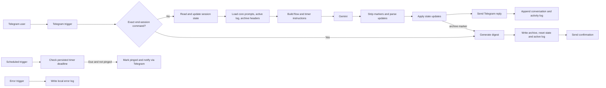

# Boker Tov

A Hebrew-first Telegram productivity coach that turns a free-text morning check-in into one concrete first task, with n8n managing session and timer state around Gemini.

## Overview

Boker Tov addresses the gap between deciding to work and starting. It guides a single user through availability, readiness, project context, and task selection, then narrows the first task to no more than 30 minutes and tracks it with a timer.

I built the n8n workflow, Hebrew coaching prompts, marker-based LLM protocol, file-backed session memory, timer polling, archive generation, and manual verification checklist. The project deliberately keeps conversational judgment in Gemini while reserving routing, timestamps, state mutations, and file writes for deterministic workflow nodes.

This is a personal experiment, not a medical or therapeutic service. Its prompts limit emotional support to lightweight coaching and direct deeper concerns to a human therapist.

## Features

- Hebrew-first Telegram coaching powered by Google Gemini.
- An 11-step, free-text morning check-in with freeze and resume behavior.
- Project-aware task selection and a first-task limit of 30 minutes.
- JSON-backed session, flow, task, and timer state.
- Timer expiry reminders, extensions, stuck-task coaching, and early cancellation.
- Session archives containing a Gemini-generated digest and the raw conversation log.
- Recall context assembled from core prompts, the active log, and archive digest headers.

## Technical Highlights

### Constrained LLM-to-workflow protocol

Gemini returns user-facing text plus hidden markers such as `[[POS: 4]]`, `[[LOG: project=...]]`, and `[[FREEZE]]`. A Code node removes those markers before the reply reaches Telegram, normalizes and validates work-window values, and encodes the extracted updates for a separate persistence node.

The persistence layer interprets only specific state-bearing keys, including `first_task`, `timer_minutes`, `timer_cancel`, and `tomorrow_notes`. This gives the model flexible language interpretation while restricting state changes to a small parser and persistence path.

### Inspectable memory with explicit limits

The prototype uses Markdown and JSON rather than a database or vector store:

- `state.json` stores the session lifecycle, flow position, current task, and timer.
- `today.md` stores the active conversation.
- `archive/` stores digest headers followed by raw session logs.
- `core/` separates identity, personal context, project context, and flow instructions.

The first three are runtime artifacts created by the workflow on the host. They are gitignored and are not tracked in this repository; a separate private repository holds their nightly snapshots.

Each model call receives the active context and the first 25 lines of every archive file. This makes memory easy to inspect and debug, but it is a single-user design with no concurrency control, indexed retrieval, or strong isolation of personal data.

### Polling instead of suspended timer executions

A scheduled branch reads the deadline from `state.json`. Once a timer is due, it persists `pinged: true` before sending the Telegram reminder, which guards against repeated notifications on later polling runs. Extensions and early completion update the same timer object through the marker protocol. This file-backed approach is simple and inspectable, but it does not provide transactional concurrency guarantees.

### Session lifecycle and diagnostics

The connected graph initializes new sessions, appends structured and conversational logs, generates an archive digest on closure, resets live state, and stores the raw log with the digest. An n8n error-trigger branch and the normal logging path write local diagnostic files on the host. A cron fallback closer archives any session left open overnight so the next morning starts from a clean state. Archived sessions stay on the host and are not published here; `docs/test-checklist.md` is a manual test plan, not evidence that every listed scenario currently passes.

## Architecture

The main runnable artifact is [`n8n-workflows/D4Iy8vHeUPpCGuzA.json`](n8n-workflows/D4Iy8vHeUPpCGuzA.json), an active 26-node n8n export. [`boker-tov-edited.json`](boker-tov-edited.json) is a separate 26-node export of the same named workflow; the files differ, so the export under `n8n-workflows/` is the documented import target.

| Path | Responsibility |
| --- | --- |
| `core/` | Persona, safety boundary, user context, projects, and morning-flow specification |
| `state.json` | Durable session and flow state (runtime, not tracked) |
| `today.md` | Active session log (runtime, not tracked) |
| `archive/` | Historical digests and raw session logs (runtime, not tracked) |
| `docs/features.md` | Intended behavior, including functionality beyond the connected workflow |
| `docs/roadmap.md` | Progress notes and planned work; some statuses lag behind the export |
| `docs/test-checklist.md` | Unexecuted manual checks spanning implemented and planned behavior |
| `calendar/`, `parked/` | Placeholder or inactive prompt material |

## Tech Stack

- n8n for orchestration and stateful workflow routing
- Telegram Bot API through n8n's Telegram nodes
- Google Gemini 3.1 Flash Lite through n8n's LangChain integration
- JavaScript in n8n Code nodes
- Python 3 and POSIX shell commands in Execute Command nodes
- Markdown and JSON for prompts, state, logs, and archives

## Getting Started

This repository is a workflow export, not a packaged application. It assumes a self-hosted Linux n8n instance that permits Execute Command nodes. Commands in the export mix `/home/ubuntu/agent` and `~/agent`, so the n8n service account's home and the repository path must resolve consistently to `/home/ubuntu/agent`, or those command paths must be updated before activation.

1. Clone or copy the repository to `/home/ubuntu/agent`, or update every embedded workflow path to the directory you use.
2. Import [`n8n-workflows/D4Iy8vHeUPpCGuzA.json`](n8n-workflows/D4Iy8vHeUPpCGuzA.json) into a self-hosted n8n instance.
3. Assign your own Telegram and Google Gemini credentials to the imported nodes.
4. Replace the personal material in `core/` with sanitized context appropriate for your use.
5. Create an empty `archive/` directory. `state.json` and `today.md` are written by the workflow on first run and are gitignored, so nothing needs clearing before you connect your own Telegram account.
6. Verify that the n8n service account can read and write the repository and execute `python3`, `base64`, and the POSIX shell commands embedded in the workflow.
7. Inspect the imported connections and run the applicable implemented checks in [`docs/test-checklist.md`](docs/test-checklist.md) before activating it.

The repository does not specify an n8n version, dependency manifest, automated installer, or automated test suite, so a reproducible installation cannot be guaranteed from the tracked files alone. The Google Calendar node and `EOD Mode Router` are disconnected and are not part of the implemented runtime path.

## Demo

> Screenshot coming soon.

## Project Status

**Experimental.** The connected export contains the morning check-in, file-backed session lifecycle, timer reminders, archive digests, and digest-header context for recall. These paths have only a manual test plan in the repository. Google Calendar planning and a fully connected guided end-of-day review remain planned; their nodes are disconnected or incomplete in the exported graph.

## What I Learned

- A small marker protocol can bridge probabilistic conversation and deterministic workflow state when parsing, mutation, and presentation are separate stages.
- File-backed memory is unusually easy to audit, but retrieval cost, concurrency, and privacy become visible constraints quickly.
- Persisting timer deadlines and polling them is a practical alternative to holding long-running workflow executions open.
- Prompt files benefit from separation by responsibility, just as application modules do; persona, safety, user context, and flow logic can evolve independently.
- Separating runtime data from source is a design decision, not a cleanup step; the split has to exist before the first commit, because history is far harder to change afterwards.
- Roadmaps and checklists are not evidence of implementation; the connected workflow graph is the source of truth.

## Privacy and Security

Session state, the active conversation log, and session archives are runtime data. They are gitignored and are not tracked here; a nightly job snapshots them to a separate private repository.

The `core/` prompt files remain tracked and describe a single user's context and projects. Replace them with your own material before running the workflow against a different Telegram account.

The workflow exports reference credentials by ID and name only. Secrets are expected to remain in n8n's credential store, and new credentials must be assigned to the imported nodes during setup.
